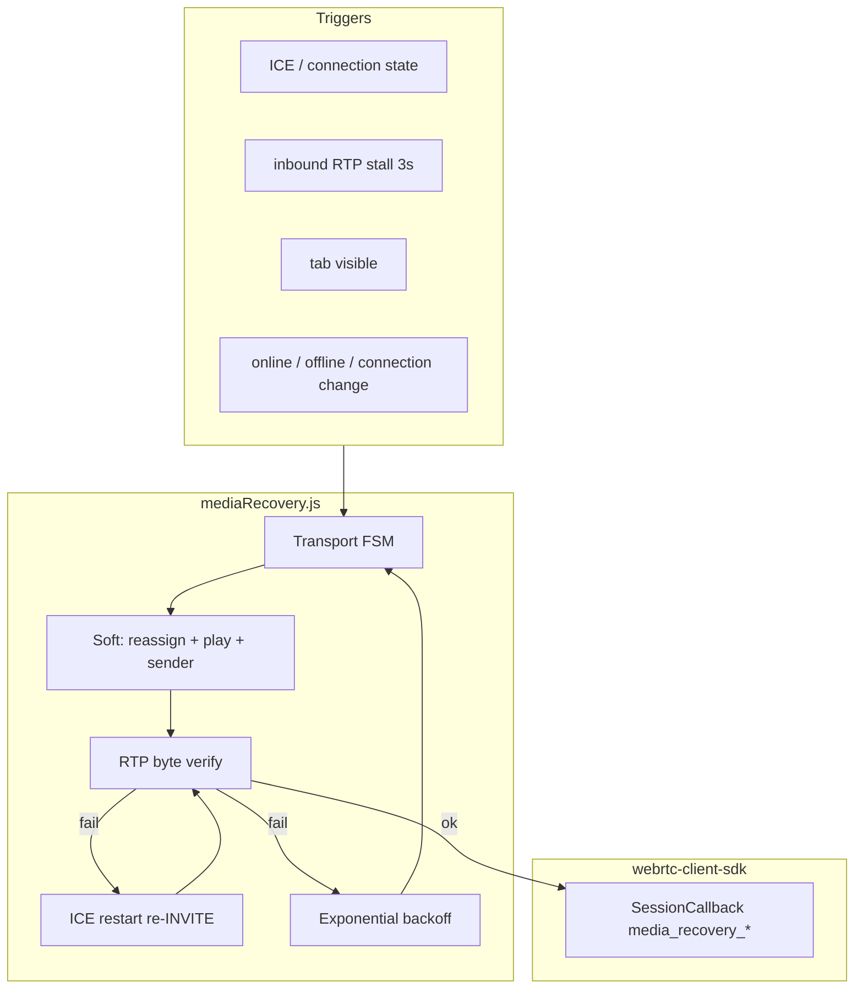

# VST-1775 — WebSDK Media Resilience (FR / NFR)

**Jira:** [VST-1775](https://exotel.atlassian.net/browse/VST-1775)  
**Release:** webrtc-core-sdk & webrtc-client-sdk **3.0.12**  
**Branch:** `VST-1775-WebSDK-Media-resilience`  
**Integrator guide:** [MEDIA-RESILIENCE.md](./MEDIA-RESILIENCE.md)  
**QA evidence:** [VST-1775-QA-EVIDENCE.md](./VST-1775-QA-EVIDENCE.md)

This document is for **principal engineer / code review**. Scope is **call media recovery only**. UI tones and ring duration are tracked separately ([VST-1783](https://exotel.atlassian.net/browse/VST-1783), [VST-1782](https://exotel.atlassian.net/browse/VST-1782)).

---

## Problem statement

Agents on VoIP WebSDK calls experienced **one-way or silent audio** after brief network loss, tab backgrounding, or ICE `disconnected` / `failed` states. Signaling (hold, mute, DTMF) often continued while the WebRTC media path did not recover. Integrators had no session events to drive “reconnecting audio” UI.

---

## Solution summary

| Layer | Change |
|-------|--------|
| Core | New [`mediaRecovery.js`](../webrtc-core-sdk/src/mediaRecovery.js) — ICE FSM, inbound RTP watchdog, visibility & network listeners, ICE restart, RTP-verified recovery |
| SIP phone | Attach/detach recovery on peer connection; `ensureRemoteAudioPlaying` on remote stream assign |
| Client | `SessionCallback` events `media_recovery_*` |
| Docs | Public integration notes; this FR/NFR; QA evidence |

---

## Functional requirements (FR)

### FR-1 — Automatic inbound audio recovery

| ID | Requirement | Implementation |
|----|-------------|----------------|
| FR-1.1 | On ICE `disconnected` / `failed` or inbound RTP stall (≥3s), SDK attempts recovery without user action | `attachMediaRecovery` + stats watchdog |
| FR-1.2 | Recovery re-assigns remote stream and calls `play()` on remote `<audio>` | `assignStream`, `ensureRemoteAudioPlaying` |
| FR-1.3 | Recovery re-enables outbound mic sender tracks after blip (when not hold/muted) | `ensureLocalAudioSending`, `replaceSenderTrack` if track ended |
| FR-1.4 | Success is reported only when **inbound RTP bytes increase** after recovery, not when `play()` alone resolves | `waitForRTPIncrease` |
| FR-1.5 | If soft recovery fails, SDK sends SIP re-INVITE with `iceRestart: true` | `doIceRestart` with Reinvite-busy retry |

### FR-2 — Session events for integrators

| ID | Requirement | Implementation |
|----|-------------|----------------|
| FR-2.1 | Emit `media_recovery_attempted` when a recovery cycle starts | `ExWebClient` → `SessionCallback` |
| FR-2.2 | Emit `media_recovery_succeeded` with `inbound_byte_delta`, ICE/connection state | Verified recovery only |
| FR-2.3 | Emit `media_recovery_degraded` when media path degrades (`signaling_ok`, `media_ok`) | ICE/network offline |
| FR-2.4 | Emit `media_recovery_failed` when a cycle fails; include `next_retry_ms` (backoff continues) | Exponential backoff, no hard stop |
| FR-2.5 | Emit `media_recovery_healthy` when backoff resets after sustained healthy RTP | 3s healthy at 500ms poll |

### FR-3 — Background tab recovery

| ID | Requirement | Implementation |
|----|-------------|----------------|
| FR-3.1 | When tab becomes `visible`, resume AudioContext and run recovery on active call | `visibilitychange` listener |
| FR-3.2 | Skip inbound stall watchdog while call is on hold or muted | `shouldSkipWatchdog` |

### FR-4 — Network interface changes

| ID | Requirement | Implementation |
|----|-------------|----------------|
| FR-4.1 | On browser `online`, attempt recovery on established session | `window.online` |
| FR-4.2 | On browser `offline`, emit degraded with `reason: network_offline` | `window.offline` |
| FR-4.3 | On `navigator.connection` change (Chrome/Edge), debounced recovery after WiFi↔cellular switch | `network_change` + 1s delay |

---

## Non-functional requirements (NFR)

### NFR-1 — Performance

| ID | Requirement | Target |
|----|-------------|--------|
| NFR-1.1 | Stats poll interval | 500ms |
| NFR-1.2 | Recovery debounce for non-urgent triggers | 1.5s minimum between attempts |
| NFR-1.3 | Single-flight recovery | One chain at a time; queue pending reason |
| NFR-1.4 | No blocking I/O on watchdog thread | `getStats()` only; SIP re-INVITE async |

### NFR-2 — Reliability

| ID | Requirement | Target |
|----|-------------|--------|
| NFR-2.1 | Exponential backoff on failed cycles | 2s → 5s → 12s → 30s → 60s; retries for call lifetime |
| NFR-2.2 | Backoff reset after healthy RTP | 3 consecutive seconds of inbound byte growth |
| NFR-2.3 | Proactive ICE restart if degraded ≥4s | `connection_degraded` timer |
| NFR-2.4 | SIP “Reinvite in progress” | Wait 2.5s, retry up to 3×; not counted as terminal failure |

### NFR-3 — Browser compatibility

| ID | Requirement | Notes |
|----|-------------|-------|
| NFR-3.1 | Chrome, Firefox, Edge | Full: visibility, online/offline, `navigator.connection` |
| NFR-3.2 | Safari 14+ | Visibility + online/offline; Network Information API may be absent |
| NFR-3.3 | `getStats()` return type | Handles Map and object iteration |

### NFR-4 — Security & privacy

| ID | Requirement | Notes |
|----|-------------|-------|
| NFR-4.1 | No credentials in recovery logs | Events use call/session ids only |
| NFR-4.2 | No extra diagnostics module in this release | Recovery logging via `mediaRecovery.js` only |

### NFR-5 — Observability

| ID | Requirement | Notes |
|----|-------------|-------|
| NFR-5.1 | Structured recovery events for CRM/UI | `inbound_byte_delta`, `rtt_sec`, `jitter_sec`, `packets_lost` on success |
| NFR-5.2 | `consecutive_failures`, `next_backoff_ms` on attempt/fail | Support triage |

### NFR-6 — Backward compatibility

| ID | Requirement | Notes |
|----|-------------|-------|
| NFR-6.1 | Existing integrators without `media_recovery_*` handlers | Calls work; events ignored |

---

## Out of scope (this PR / card)

| Item | Tracked in |
|------|------------|
| UI tone playback (`primeUiTones`, webpack WAV) | [VST-1783](https://exotel.atlassian.net/browse/VST-1783) |
| Configurable ring duration (`setRingingDuration`) | [VST-1782](https://exotel.atlassian.net/browse/VST-1782) |
| `webrtcDiagnostics.js` | Removed from 1775; not required for AC |
| TURN relay fallback | Infra / separate epic |
| Sample React UI refactor | Separate PR |
| Voice quality pipeline | Separate PR |

---

## Architecture (high level)

---

## Files in this branch (review scope)

| File | Purpose |
|------|---------|
| `webrtc-core-sdk/src/mediaRecovery.js` | Core recovery module |
| `webrtc-core-sdk/src/sipjsphone.js` | Attach/detach recovery; `ensureRemoteAudioPlaying` |
| `webrtc-core-sdk/src/audioDeviceManager.js` | `ensureAudioContextRunning` for visibility recovery |
| `webrtc-core-sdk/src/webrtcSIPPhoneEventDelegate.js` | `onMediaRecoveryEvent` |
| `webrtc-client-sdk/src/listeners/ExWebClient.js` | Session events |
| `webrtc-core-sdk/index.js` | Export `mediaRecovery` |
| `*/Changelog`, `*/package.json` | 3.0.12 release |
| `docs/MEDIA-RESILIENCE.md` | Integrator API |
| `docs/VST-1775-FR-NFR.md` | This document |
| `docs/VST-1775-QA-EVIDENCE.md` | Manual QA matrix |
| `README.md` | Link to docs |

**Not included:** ring duration, UI tones, `webrtcDiagnostics.js`, `sample-react-ui/**`, `*.tar.gz`.

---

## Release & delivery

1. **npm:** `@exotel-npm-dev/webrtc-core-sdk@3.0.12`, `@exotel-npm-dev/webrtc-client-sdk@3.0.12`
2. **Bundle (non-npm):** `cd webrtc-client-sdk && make build-local && make tar` → attach to Jira; **do not commit** tar to git
3. **PR:** `VST-1775-WebSDK-Media-resilience` → `master`
